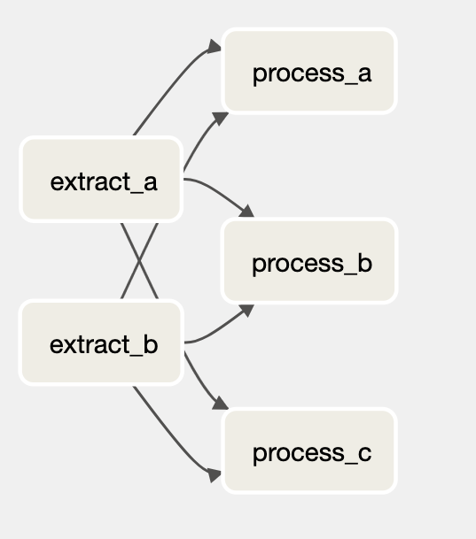

## ETL with Airflow

In this example we have created data pipelines with Apache Airflow. We have used different Airflow operators and sensors to extract, transform and load data. Here is the list of Hooks, Operators and Sensors we have used:

- PythonOperator
- BashOperator
- SFTPOperator
- PostgresOperator
- DummyOperator
- ExternalTaskSensor
- BaseHook
- MsSqlHook

We have used ContosRetailDW database which has been restored to SQL Server, API Exchange Rate data from https://openexchangerates.org, CSV file and Azure Blob Storage as SFTP Server. Data has been extracted, transformed and loaded to Postgres database. We have created 2 dags which will be explained below. To keep it clean and secured we did few steps:

- keep [functions](dags/includes/db_etl/functions.py) in separate script
- keep credentials in Airflow Variables and Connections
- use [TaskGroup](dags/extract_load_to_db.py) to organize tasks
- use [ExternalTaskSensor](dags/process_load_to_db.py) to start next dag

### 1. [ETL](dags/extract_load_to_db.py)

 
 
 This dag containes extracting, transforming and loading data to Postgres DB:
  + Extract data from SQL Server and load it to Postgres
  + Fetch data with API and store it to Postgres
  + Store data from CSV file into Postgres
  + PUT and GET file from SFTP Server
 
 ### 2. [External Task Sensor and Processing](dags/process_load_to_db.py)
 
 
  + Use ExternalTaskSensor to listen for previous dag to finish sucesscully
  + Extract data from SQL Server and Postgres
  + Merge and process data
  + Load data to Postgres

## Important Airflow commands

### Retries

Retries refers to a feature that allows you to specify how many times a failed task should be retried before considering it a permanent failure. When you define a task in an Airflow DAG (Directed Acyclic Graph), you can set the number of retries for that task. If the task fails during its execution, Airflow will automatically attempt to rerun the task for the specified number of retries.

We can set retries:

- In the airflow.cfg: `default_task_retries = <number_of_retries>`. In this case every task will be retry `<number_of_retries>` we have set.
- With the task and any Airflew Operator, for example: `task_a=BashOperator(task_id="task_a", retries=<number_of_retries>)`
  - we can add retry delay: `task_b = BashOperator(task_id="task_a",retries = <number_of_retries>, retry_delay=timedelta(seconds=<num_of_seconds>)`
  - and `retry_exponential_backoff` If set to True, it enables exponential backoff for retries.: `task_b = BashOperator(task_id="task_a",retries = <number_of_retries>, retry_exponential_backoff = True, retry_delay=timedelta(seconds=<num_of_seconds>)`. This is especially useful for API calls.

### Email Notifications

In this example we will use gmail to send notifications:

- Open your browser and go to: `https://security.google.com/settings/security/apppasswords`
- Create App password and save it.
- Open airflow.cfg, find `[smtp]` and do next:
  - `smtp_host = smtp.gmail.com`
  - `smtp_user = <your_email_address>`
  - `smtp_password = <app_password>`
  - `smtp_port = 587`
  - `smtp_mail_from = <your_email_address>`
- Save the file and in the terminal run: `docker-compose down && docker-compose up -d`
- In the ask add email you want to receive the notification: `task_b = BashOperator(task_id="task_b",email=["<email_address>"] ...`. This will notify for a failure and retry. We can set it by adding:
  - `email_on_retry=False or True`
  - `email_on_failure=False or True`
- If we want notification for every task then we will add it at the begining to default_args:
  - `"email": ["<email_address>"]`
  - `"email_on_retry": False or True`
  - `"email_on_failure": False or True`
- To set it for the entire Airflow instance go in the airflow.cfg. Search for `[email]` and set True or False for:

  - `default_email_on_retry`
  - `default_email_on_failure`

- To set the email content go in the airflow.cfg. Search for `[email]`. In there set next:
  - `subject_template = /opt/airflow/includes/subject_template_email.txt`
  - `html_content_template = /opt/airflow/includes/content_template_email.txt`
- Got to `includes` folder and create 2 new files:
  - `subject_template_email.txt`
  - `content_template_email.txt`
- Here we can see how `default_html_content` looks: https://github.com/apache/airflow/blob/main/airflow/models/taskinstance.py
- In the file we can search for `@property` and those are the properties we can use in the templates.
- Fill the `subject_template_email.txt` and `content_template_email.txt` with information you would like to receive in the email.

### Airflow Task Test

If your Airflow runs on Docker copy container id for scheduler and run: `docker exec -it <container_id> /bin/bash`

- In terminal run: `airflow tasks test <dag_id> <task_id> <date_in_the_past>`

### Task Dependecy between DAG runs

Task Dependecy will check if dag has succed or been skipped in the past, and if that's the case it will run again.

- In the Airflow Operator add the `depends_on_past=True`. For example: `task_c = PythonOperator(task_id="task_c", depends_on_past=True)`
- In the DAG add `dagrun_timeout`: This parameter defines the maximum allowed execution time for a DAG run. It specifies the duration, in which a DAG run should complete, from the time it is started to the time it is expected to finish. If a DAG run exceeds this timeout, it will be marked as failed. For example: `dagrun_timeout= timedelta(hours=2)`

### Task Priority

Task priority, often referred to as "task priority weight," is a mechanism that allows you to assign relative importance or priority levels to tasks within a DAG. This priority weight is used by the Airflow scheduler to determine the order in which tasks should be executed when multiple tasks are ready to run simultaneously.

- In the Operator add: `priority_weight = number`
- Tasks with higher priority weights will be prioritized for execution over tasks with lower priority weights.

### Trigger Rule

In Apache Airflow, `trigger_rule` is an attribute that you can set for an operator within a Directed DAG. It determines the conditions under which the operator should be triggered to execute. The trigger_rule specifies the logic that Airflow should use when deciding whether to execute an operator or skip it.

- `all_success` (Default): The operator will be triggered to run only if all of its directly upstream tasks (dependencies) have succeeded. If any of the upstream tasks fail, the operator will not be executed.

- `all_failed`: The operator will be triggered to run only if all of its directly upstream tasks have failed. If any of the upstream tasks succeed, the operator will not be executed.

- `all_done`: The operator will be triggered to run regardless of the status of its upstream tasks. It will execute as long as all upstream tasks have completed, whether they succeeded or failed.

- `one_success`: The operator will be triggered to run if at least one of its upstream tasks has succeeded. It will execute even if some upstream tasks fail.

- `one_failed`: The operator will be triggered to run if at least one of its upstream tasks has failed. It will execute even if some upstream tasks succeed.

- `none_failed`: The operator will be triggered to run only if none of its upstream tasks have failed. If any of the upstream tasks fail, the operator will not be executed.

- `none_skipped`: The operator will be triggered to run only if none of its directly upstream tasks were skipped. If any of the upstream tasks were skipped (e.g., due to a BranchPythonOperator), the operator will not be executed.

### Timeout

There 2 types of timeout `dagrun_timeout` and

- In the DAG add `dagrun_timeout`: This parameter defines the maximum allowed execution time for a DAG run. It specifies the duration, in which a DAG run should complete, from the time it is started to the time it is expected to finish. If a DAG run exceeds this timeout, it will be marked as failed. For example: `dagrun_timeout= timedelta(hours=2)`
- In Apache Airflow, the `execution_timeout` parameter is used to set a time limit on how long a specific task within a DAG is allowed to run. It defines the maximum duration that a task is permitted to execute before being forcibly terminated by Airflow. For example, add it to the Operator: `execution_timeout=timedelta(hours=1)`
  - Airflow will mark the task as failed and record the timeout in the task's logs
  - Depending on your DAG configuration, you can set up actions to handle task timeouts, such as sending notifications, cleaning up resources, or triggering other tasks.
  - You can use Airflow's on_failure_callback or on_timeout_callback parameters to define custom actions when a task fails or times out.

### Callbacks

#### Task Callbacks:

- `on_failure_callback`: This callback is executed when a task fails. You can define custom actions to take in response to a task failure, such as sending notifications, logging, or triggering other tasks.

- `on_retry_callback`: This callback is executed when a task is retried. It allows you to define custom behavior when a task is retried due to a failure.

- `on_success_callback`: This callback is executed when a task succeeds. You can use it to perform custom actions after a task completes successfully.

#### DAG Callbacks:

- `on_failure_callback`: This callback is executed when any task within the DAG fails. It allows you to define custom actions to handle DAG-level failures.

- `on_success_callback`: This callback is executed when all tasks within the DAG succeed. It can be used to perform actions after the entire DAG has completed successfully.

### XComs

XComs (short for "cross-communication") are a way for tasks within a DAG to exchange small amounts of data between each other. XComs allow tasks to share information such as results, status, or any other data that can be serialized and deserialized.

- Setting XCom Values: To set an XCom value within a task, you can use the `xcom_push` method of the task context.
- Retrieving XCom Values: To retrieve an XCom value within a task, you can use the `xcom_pull` method of the task context.

### Pools

Pools provide a way to manage and control the concurrency of tasks within your workflows. They allow you to limit the number of tasks that can run concurrently for a specific resource or group of resources. Pools are particularly useful in scenarios where you want to prevent overloading resources like external APIs, databases, or other shared resources.

### task_cuncurrency

`task_concurrency` parameter is used to control the maximum number of concurrently running instances (tasks) of a particular task in a DAG. It allows you to set a concurrency limit on a specific task, which can be useful for scenarios where you want to restrict the parallel execution of a particular task, regardless of other tasks in the same DAG.

- `task_concurrency` parameter is specific to each task, and it sets the concurrency limit for that task only. It does not affect the concurrency of other tasks in the same DAG. If you want to control the overall concurrency of all tasks in a DAG, you should consider using resource pools or other mechanisms to manage task concurrency at the DAG level.

### cross_downstream

- `cross_downstream([extract_a, extract_b], [process_a, process_b, process_c])` will give result like from the picture below:
  

## Airflow Operators

### Install Python packages with Docker

To install additional python packages we need:

- Create `requirements.txt` file and all python packages file we want to install.
- Create `Dockerfile`
- Go to docker-compose.yml and replace: `image: apache/airflow:2.1.0` with `build: context: .`
- Run again `docker-compose up -d`
- And if you want to check all the Airflow porviders that are installed run: `docker exec <airflow_scheduler_docekr_id> airflow info`

### Python Operator

PythonOperator is one of the most commonly used operators. It allows you to define a custom Python function or callable to be executed as a task within an Airflow DAG.

### Python Taskflow API

The TaskFlow API in Apache Airflow provides a higher-level abstraction for defining complex workflows compared to the traditional DAG-based approach. It allows you to define tasks and dependencies in a more structured and object-oriented way, making it easier to create and manage complex workflows.

### BranchPythonOperator

The BranchPythonOperator in Apache Airflow is used to create conditional branching in your DAG. It allows you to define a Python function that determines which task or tasks should be executed next based on certain conditions. The Python function should return the task ID(s) of the task(s) to be executed next.

### Task Group

Airflow task groups are a tool to organize tasks into groups within your DAGs. Most often used to visually organize complicated DAGs. For example, you might use task groups:

- In big ELT/ETL DAGs, where you have a task group per table or schema.
- In MLOps DAGs, where you have a task group per model being trained.
- In DAGs owned by several teams, where you have task groups to visually separate the tasks that belong to each team. Although in this case, it might be better to separate the DAG into multiple DAGs and use Datasets to connect them.
- When you are using the same patterns of tasks in multiple DAGs and want to create a reusable module.

## Dependencies

### TriggerDagRunOperator

The TriggerDagRunOperator in Apache Airflow is an operator that allows you to trigger the execution of another DAG from within your current DAG. It provides a way to create a relationship between two DAGs where one DAG triggers the execution of another as a sub-DAG. This can be useful for orchestrating complex workflows or breaking down large workflows into smaller, more manageable pieces.

### ExternalTaskSensor

The ExternalTaskSensor in Apache Airflow is an operator used to wait for the completion of a specific task in another DAG before allowing the current DAG to proceed. It's commonly used when you have multiple interrelated DAGs and need to coordinate their execution.

### ShortCircuitOperator

The ShortCircuitOperator in Apache Airflow is an operator that allows you to conditionally skip downstream tasks in a DAG based on a Python callable. It is particularly useful when you want to short-circuit the execution of certain tasks within your workflow if a specified condition is met.
