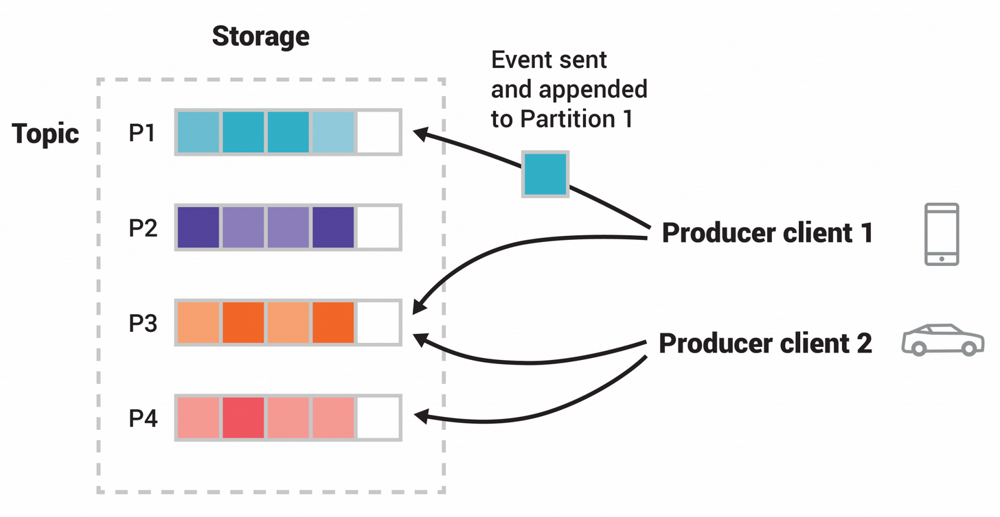

### Kafka

Apache Kafka is an open-source distributed streaming platform, designed to handle high-throughput, real-time data feeds. It provides a publish-subscribe messaging system, which is durable, fast, and scalable.

Some key features and components of Apache Kafka:
1. **Publish-Subscribe Messaging System:** Kafka allows producers to publish messages to a topic and consumers to subscribe to one or more topics and process the messages in real-time.
2. **Distributed and Fault-Tolerant:** Kafka is designed to be distributed across multiple servers, allowing it to handle large amounts of data and providing fault tolerance through replication.

3. **Scalability:** Kafka scales horizontally by adding more broker nodes to the cluster, allowing it to handle increased throughput and storage requirements.

4. **Retention:** Kafka retains messages for a configurable period of time, even after they have been consumed, allowing consumers to replay messages from the past.

5. **Streams Processing:** Kafka Streams API allows developers to build real-time stream processing applications that can process and analyze data as it flows through Kafka topics.

6. **Connectors:** Kafka Connect provides a framework for connecting Kafka with external systems, making it easy to integrate Kafka with databases, message queues, and other data sources and sinks.

7. **Monitoring and Management:** Kafka comes with built-in tools for monitoring and managing Kafka clusters, including tools for monitoring performance, tracking consumer lag, and managing topics and partitions.

Apache Kafka is widely used in various industries for building real-time data pipelines, streaming analytics, and event-driven architectures. It is commonly used for tasks such as activity tracking, log aggregation, event sourcing, and stream processing in industries like finance, retail, telecommunications, and more.

### Kafka Topic
Kafka Topic allows users to store and organize data according to different categories and use cases, allowing users to easily produce and consume messages to and from the Kafka Servers. In other words, Kafka Topics are Virtual Groups or Logs that hold messages and events in a logical order, allowing users to send and receive data between Kafka Servers with ease.

  

  When a Producer sends messages or events into a specific Kafka Topic, the topics will append the messages one after another, thereby creating a **Log File**. Furthermore, producers can Push Messages into the tail of these newly created logs while consumers Pull Messages off from a specific Kafka Topic.

  ### Kafka Partition

Apache Kafka’s single biggest advantage is its ability to scale. Apache Kafka divides Topics into several **Partitions**. For better understanding, you can imagine Kafka Topic as a giant set and Kafka Partitions to be smaller subsets of Records that are owned by Kafka Topics.

Kafka Partitions allow Topics to be parallelized by splitting the data of a particular Kafka Topic across multiple **Brokers**. Each Broker holds a subset of Records that belongs to the entire Kafka Cluster.

Apache Kafka kafka achieves replication at the Partition level. Redundant units in Topic Partitions are referred to as **Replicas**, and each Partition generally contains one or more Replicas. That is, the Partition contains messages that are replicated through several Kafka Brokers in the Cluster. Each Partition (Replica) has one Server that acts as a Leader and another set of Servers that act as Followers. 
  

A Kafka Leader replica handles all read/write requests for a particular Partition, and Kafka Followers imitate the Leader. Apache Kafka is intelligent enough, that if in any case, your Lead Server goes down, one of the Follower Servers becomes the Leader. 

When a **Producer** publishes a Record to a Topic, it is assigned to its Leader. The Leader adds the record to the commit log and increments the Record Offset. Kafka makes Records available to consumers only after they have been committed, and all incoming data is stacked in the Kafka **Cluster**. 

### Kafka Brokers

Kafka brokers are a fundamental component of Apache Kafka, an open-source distributed event streaming platform. In Kafka's architecture, brokers are responsible for storing and managing the stream of records (messages) that are sent by producers and consumed by consumers.

1. **Message Storage**: Brokers store the topic logs, which consist of the records published by producers. These logs are stored on disk and replicated across multiple brokers for fault tolerance.

2. **Partitioning**: Topics in Kafka are divided into partitions, and each partition is replicated across multiple brokers. Brokers handle partitioning, distribution, and replication of topic partitions.

3. **Producers and Consumers Interaction**: Producers publish messages to Kafka brokers, specifying the topic to which the message should be sent. Consumers subscribe to topics and consume messages from brokers.

4. **Scalability**: Kafka brokers can be horizontally scaled by adding more broker instances to a Kafka cluster. This allows Kafka to handle large volumes of data and high throughput.

5. **Cluster Coordination**: Kafka brokers coordinate with each other to maintain cluster membership, manage partition leadership, and ensure data replication.

6. **Fault Tolerance**: Kafka provides fault tolerance by replicating data across multiple brokers. If a broker fails, Kafka can continue to operate by promoting replicas to leaders and electing new leaders for partitions.

  

### Kafka Cluster

Kafka broker acts as a mediator between the systems to smoothly transfer the message from the source to the destination.

When there is a band containing more than one broker working together that is termed the Kafka Cluster. The number of brokers in a Kafka Cluster contain can range from one to three or can even potentially contain hundreds of brokers. Organizations dealing with streaming data such as Netflix, Hotstar+, Ola, and Uber contain thousands of Kafka brokers for effectively managing and handling the data.

Any specific Kafka broker residing in a Kafka cluster could be recognized via its unique numeric ID.

The **Zookeeper** plays a crucial role as a part of the Kafka cluster. It helps to synchronize, manage as well as handle the entire distributed configuration. Zookeeper also acts as the coordinator interface for the multiple Kafka brokers and consumers.

### Kafka Producers

Kafka Producers are components responsible for publishing data records, often referred to as messages, to Kafka topics within a Kafka cluster. Here are some key aspects of Kafka producers:

1. **Publishing Messages**: Producers are designed to send messages to Kafka brokers, specifying the topic to which the message should be published. Topics are logical channels or categories to which messages are organized and stored within Kafka.

2. **Asynchronous and Synchronous Operations**: Producers can operate in both asynchronous and synchronous modes. In asynchronous mode, the producer sends messages without waiting for acknowledgments from the Kafka brokers. In synchronous mode, the producer waits for acknowledgments before sending the next message.

3. **Partitioning Strategy**: Producers can choose to either specify a target partition for each message or allow Kafka to use a partitioning strategy to determine the target partition based on the message key. This allows for parallelism and scalability in message processing.

4. **Message Compression**: Producers can optionally compress messages before sending them to Kafka, which can help reduce network overhead and storage costs, especially for large volumes of data.

5. **Message Acknowledgment**: Producers can receive acknowledgments from Kafka brokers once messages are successfully published to the specified topic partitions. This acknowledgment confirms that the message has been persisted and replicated within the Kafka cluster.

6. **Error Handling**: Producers handle various types of errors, including network failures, broker unavailability, and partition leader changes. They can be configured to retry failed message deliveries and handle errors gracefully.

7. **Batching**: Producers often use batching techniques to improve throughput by sending multiple messages in a single request to Kafka brokers, reducing the overhead of network round trips.

8. **Customization**: Producers offer various configuration options to customize their behavior, including settings for message serialization, buffer size, and retry policies.

Overall, Kafka producers are essential components for ingesting data into Kafka clusters, enabling real-time data pipelines, event-driven architectures, and stream processing applications. They provide flexibility, reliability, and scalability for publishing messages to Kafka topics efficiently.

### Kafka Consumers

Consumers are components responsible for subscribing to Kafka topics and consuming data records, or messages, from those topics within a Kafka cluster. Here are some key aspects of Kafka consumers:

1. **Subscribing to Topics**: Consumers subscribe to one or more Kafka topics from which they want to consume messages. 

2. **Partition Assignment**: When a consumer subscribes to a topic, Kafka assigns one or more partitions of that topic to the consumer. Each partition is consumed by only one consumer within a consumer group, ensuring parallel processing of messages.

3. **Consumer Groups**: Consumers within Kafka are organized into consumer groups. Each consumer group consists of one or more consumers that jointly consume all the partitions of the topics they are subscribed to. Kafka ensures that each partition is consumed by exactly one consumer within the group, enabling parallelism and load balancing.

4. **Offset Management**: Kafka maintains an offset for each consumer, which represents the position of the consumer within each partition. Consumers can commit offsets to Kafka to indicate which messages they have processed successfully. This allows consumers to resume from the last processed offset in case of failures or restarts.

5. **At-Least-Once Delivery**: Kafka provides at-least-once message delivery semantics to consumers. This means that Kafka ensures that every message published to a topic is eventually consumed by consumers, but it may be delivered more than once in case of failures or retries.

6. **Exactly-Once Semantics**: Kafka also supports exactly-once message processing semantics with proper configuration and usage of transactional producers and idempotent producers. This ensures that each message is processed exactly once, even in the presence of failures or retries.

7. **Parallelism and Scalability**: Kafka consumers can be scaled horizontally by adding more consumer instances to a consumer group. Kafka automatically rebalances partitions among consumers within a group when the group membership changes, enabling dynamic scalability and fault tolerance.

8. **Customization**: Consumers offer various configuration options to customize their behavior, including settings for message deserialization, parallelism, and offset management.

Overall, Kafka consumers are essential components for consuming and processing data from Kafka topics, enabling real-time data processing, analytics, and integration with downstream systems. They provide flexibility, reliability, and scalability for building robust and efficient data pipelines and applications.

### Kafka Connect

Kafka Connect is a framework for building scalable and reliable streaming data pipelines between Apache Kafka and other data systems. It is part of the Apache Kafka project and is commonly used for integrating Kafka with external data sources or sinks, such as databases, file systems, message queues, and more.

1. **Connector**: Kafka Connect provides a set of pre-built connectors, called "connectors," for integrating with various data sources and sinks. These connectors handle the logic for reading data from or writing data to external systems.

2. **Scalability**: Kafka Connect is designed for horizontal scalability, allowing you to scale out by adding more worker nodes to handle higher throughput or processing requirements.

3. **Configurability**: Connectors and Kafka Connect itself are highly configurable, allowing you to customize settings such as data formats, serialization, error handling, and more.

4. **Fault Tolerance**: Kafka Connect provides fault tolerance mechanisms to ensure data integrity and reliability, such as offset management, automatic error recovery, and distributed processing.

5. **REST API**: Kafka Connect exposes a REST API for managing connectors, monitoring status, and configuring settings programmatically.

6. **Ecosystem Integration**: Kafka Connect integrates seamlessly with the broader Kafka ecosystem, including Apache Kafka itself, Kafka Streams, and other Kafka-related tools and libraries.

Kafka Connect simplifies the process of building and managing data pipelines, making it easier to ingest and process data from various sources in real-time using Apache Kafka.

### Kafka Schema Registry

The Kafka Schema Registry is a component of the Apache Kafka ecosystem designed to manage the schemas used by producers and consumers of Kafka messages. It provides a centralized repository for storing and versioning Avro, JSON, or other schema formats. 

1. **Schema Evolution**: In a Kafka ecosystem where multiple producers and consumers are involved, schemas are prone to evolve over time. Changes may include adding new fields, renaming existing ones, or altering data types. The Schema Registry helps manage these changes by maintaining a history of schema versions.

2. **Compatibility**: When schemas evolve, it's crucial to ensure backward and forward compatibility to prevent data loss and maintain system reliability. The Schema Registry offers tools to check compatibility between different versions of schemas, allowing for smooth upgrades and deployments.

3. **Schema Validation**: Producers can register schemas with the Schema Registry, and the registry validates them to ensure they comply with predefined rules. This helps maintain data integrity within the Kafka ecosystem.

4. **Schema Versioning**: Each schema registered in the Schema Registry is assigned a unique identifier. As schemas evolve, new versions are created, and consumers can specify which version of the schema they want to use when reading messages.

5. **Interoperability**: The Schema Registry promotes interoperability between different components of the Kafka ecosystem. By providing a centralized location for managing schemas, it ensures that producers and consumers across various applications can communicate effectively.

6. **Performance**: While the Schema Registry adds an additional layer of complexity to the Kafka ecosystem, it can improve performance by reducing the size of messages. Instead of embedding the schema with each message, producers only need to include the schema ID, saving bandwidth and storage space.

### Kafka Streams

Kafka Streams is a Java library within the Apache Kafka project that allows developers to build real-time streaming applications on top of Kafka. It provides a high-level abstraction for processing and analyzing data streams with Kafka's distributed messaging capabilities.

1. **Stream Processing**: Kafka Streams enables developers to perform stream processing tasks such as filtering, transforming, aggregating, and joining data streams in real-time. It allows you to build stateful and stateless processing topologies to handle complex data processing requirements.

2. **Fault Tolerance**: Kafka Streams leverages Kafka's built-in fault tolerance mechanisms, such as partition replication and data retention, to ensure reliability and durability of stream processing tasks. It also supports fault tolerance for stateful operations through state replication and restoration mechanisms.

3. **Scalability**: Kafka Streams applications can scale horizontally by adding more instances or partitions to handle increased data processing loads. It integrates seamlessly with Kafka's distributed architecture, allowing applications to scale across multiple nodes and clusters.

4. **Exactly-once Processing**: Kafka Streams provides support for exactly-once processing semantics, ensuring that each record is processed exactly once despite failures or retries. This is achieved through transactional processing and idempotent operations within Kafka.

5. **State Management**: Kafka Streams allows developers to maintain and manage state within stream processing applications. It provides APIs for storing and querying stateful data, such as key-value stores or windowed aggregates, which can be used to enrich, filter, or analyze incoming data streams.

6. **Integration with Kafka**: Kafka Streams is tightly integrated with Apache Kafka, leveraging Kafka topics as input and output streams for stream processing tasks. It provides simple APIs for consuming and producing messages, as well as for defining stream processing topologies using the Kafka Streams DSL or Processor API.

7. **Lightweight Deployment**: Kafka Streams applications can be deployed as standalone Java applications or as part of a larger microservices architecture. They do not require additional infrastructure or external dependencies, making deployment and management relatively simple.

Kafka Streams provides a powerful and flexible framework for building real-time stream processing applications on top of Apache Kafka. It simplifies the development of complex data pipelines and enables developers to leverage Kafka's scalability, fault tolerance, and performance characteristics for building robust and scalable streaming solutions.

