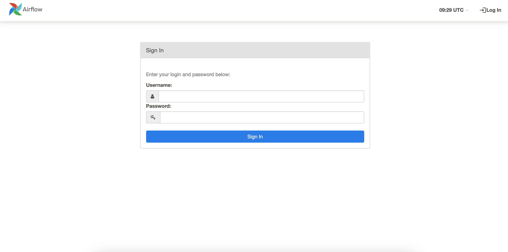

## Installing Apache Airlfow

Before any Apache Airflow installation we must make sure we have Docker and vscode installed. We can do it with help from these links:

- [Docker](https://docs.docker.com/get-docker/)
- [VS Code](https://code.visualstudio.com/download)

### Install Apache Airflow with Docker

1. Create folder
2. In the folder download [docker-compose](https://airflow.apache.org/docs/apache-airflow/2.5.1/docker-compose.yaml) and save it as docker-compose.yaml
3. Open your terminal or CMD and go to the folder
4. Open vscode by typing `code .`
5. Right click below docker-compose.yml and create a new file `.env` and add this and save the file:
   - AIRFLOW_IMAGE_NAME=apache/airflow:2.4.2
   - AIRFLOW_UID=50000
6. Go at the top bar of Visual Studio Code -> Terminal -> New Terminal
7. In your new terminal at the bottom, type the command `docker-compose up -d` and hit `ENTER`. It could take up to 5 mins as Docker is downloading the Airflow to run it.
8. After it's done open your web browser and go to `localhost:8080`. You should see Airflow Sign In page.
9. Default Username and Password is: `airflow`
10. To stop Docker airflow run `docker-compose stop` and to start it again `docker-compose start` or restart with `docker-compose restart`
11. If you make changes to your docker-compose.yaml file or you want to recreate your containers with fresh configurations then run `docker-compose up` again.

   
