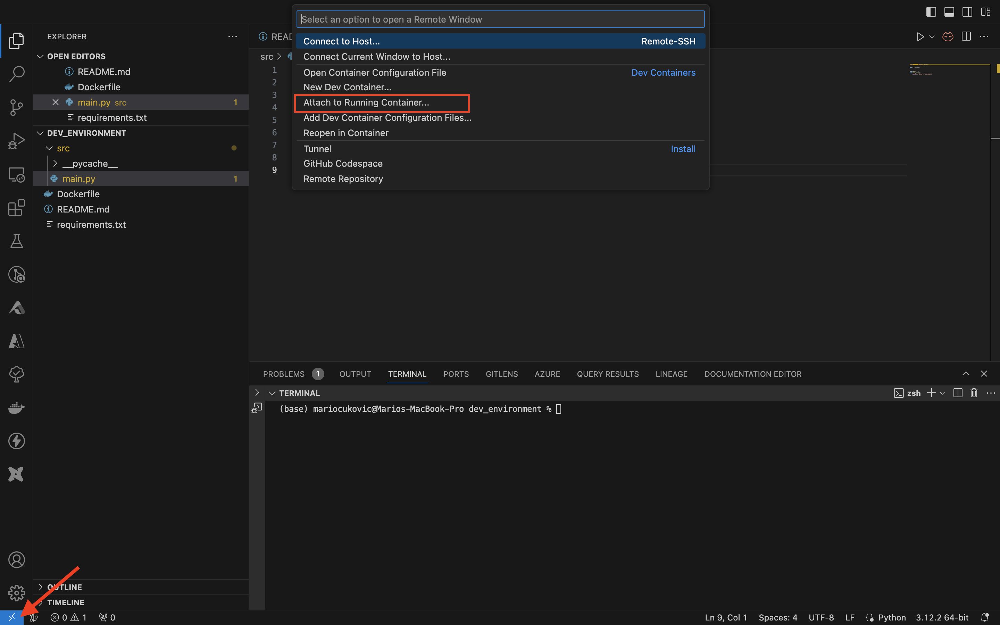

### Docker dev environment

In this example we will create Python evnironment with Docker. This is more than just virtual environment as we get Linux OS which gives us more freedom as we can add multiple services and dependicies, and we can easily deploy it to the cloud and share with others.
 
1. Create `requirements.txt` file and add libraries you want to install when run Docker
2. Create new folder, we'll call it `src`, and create `main.py` file inside of the folder.
3. Create `Dockerfile` and add this:
   - `FROM python:3.12-slim` - This line specifies the base image to use for building this Docker image. In this case, it's a slim version of Python 3.10, which means it has a minimal set of packages installed, making the resulting image smaller in size.
   - `WORKDIR /code` - This line sets the working directory inside the Docker container to /code. This is where subsequent commands will be executed unless specified otherwise.
   - `COPY ./requirements.txt ./` - This line copies the requirements.txt file from the host machine (where the Dockerfile is located) to the /code directory inside the Docker container. 
   - `RUN pip install --no-cache-dir -r requirements.txt` - This line installs the Python dependencies listed in the `requirements.txt` file into the Docker container using pip. The `--no-cache-dir` flag tells pip not to cache the downloaded packages, which helps keep the image size smaller.
   - `COPY ./src ./src` - This line copies the source code of the Python application from the host machine to the /code/src directory inside the Docker container. This assumes that the source code of the application is located in a directory named src in the same directory as the Dockerfile.
   - `CMD ["uvicorn", "src.main:app", "--host", "0.0.0.0", "--port", "80", "--reload"]` - This line specifies the command to run when a container based on this image is started. It runs the Uvicorn ASGI server with the `main` module's `app` object as the application, listening on `0.0.0.0:80` (all available network interfaces on port 80). The `--reload` flag tells Uvicorn to automatically reload the application when the source code changes, which is useful for development purposes.
4. In the terminal run:
   - `docker build -t fastapi-image .`
     - `docker build` - This is the command to build a Docker image.
     - `-t fastapi-image` - This option (`-t`) is used to tag the resulting image with a name. In this case, the name chosen is `fastapi-image`.
     - `.` - This specifies the build context. In this context, `.` refers to the current directory where the Dockerfile is located. The build context includes all the files and directories in this location, which are used by Docker during the build process.
   - `docker images` - this will show all the Docker images.
   - `docker run --name fastapi-container -p 80:80 -d -v "$(pwd)":/code fastapi-image:latest`
    - `docker run` - This command is used to run a Docker container.
    - `--name fastapi-container` - This option specifies the name of the container as fastapi-container.
    - `-p 80:80` - This option maps port 80 on the host machine to port 80 on the Docker container. It allows traffic to reach the application inside the container via port 80 on the host.
    - `-d` - This option runs the container in detached mode, meaning it runs in the background.
    - `-v "$(pwd)":/code` - This option mounts the current directory `$(pwd)` on the host to the `/code` directory inside the container. The `$(pwd)` command retrieves the current directory, and the quotation marks `"` are used to handle paths that contain spaces properly.
    - `fastapi-image:latest` - This specifies the Docker image to use for creating the container. fastapi-image is the name of the image, and latest is the tag indicating the version.
5. In the browser go to `localhost` and we should see `{"Hello": "World"}`.

#### Attach to Running Container

To be able to work in the enviroment we need to attache to running container:

1. In the vscode install 2 extensions: `Docker` & `Dev Containers`.
2. Click on the `Open a Remote Window`
3. Click the running container, in our case `/fastapi-container`. The new vscode window will open.

4. Once we are inside, we'll have to install Python extension (only first time).

### Docker compose

Docker Compose is a tool provided by Docker for defining and running multi-container Docker applications. It allows you to use a YAML file (usually named docker-compose.yml) to configure the services, networks, and volumes needed for your application, making it easier to manage and run multiple Docker containers together as a single application stack.

To run the docker now, all we have to do is:
 - `docker-compose up`
 - `docker-compose up --build -d` - if make changes in `docker-compose.yaml` then we have to run this

The Docker Compose configuration defines two services: `app` and `redis`. Let's break down each section:
#### Service app:
- `build: .` -  This indicates that the Dockerfile for building the app service is located in the current directory `.`. Docker Compose will build the image for the app service using the Dockerfile found in the current directory
- `container_name: python-server` - This sets the name of the container to `python-server`.
- `command: uvicorn src.main:app --host 0.0.0.0 --port 80 --reload` - This specifies the command to run when the container starts. In this case, it starts the Uvicorn ASGI server with the main module's `app` object as the application, listening on `0.0.0.0:80` (all available network interfaces on port 80), and with the `--reload` flag for automatic reloading when the source code changes.
- `ports: - 80:80` - This maps port 80 on the host to port 80 on the container, allowing incoming connections to reach the application inside the container.
- `volumes: - .:/code` - This mounts the current directory `.` on the host to the `/code` directory inside the container. This is a bind mount, meaning that changes made to files in the current directory on the host will be reflected in the `/code` directory inside the container.
- `depends_on: - redis` - This indicates that the app service depends on the redis service. Docker Compose will start the `redis` service before starting the `app` service.

#### Service redis:
`image: redis:alpine` - This specifies the Docker image `redis:alpine` to use for the redis service. It pulls the Redis image with the Alpine Linux distribution as the base image. This service doesn't require any additional configuration.