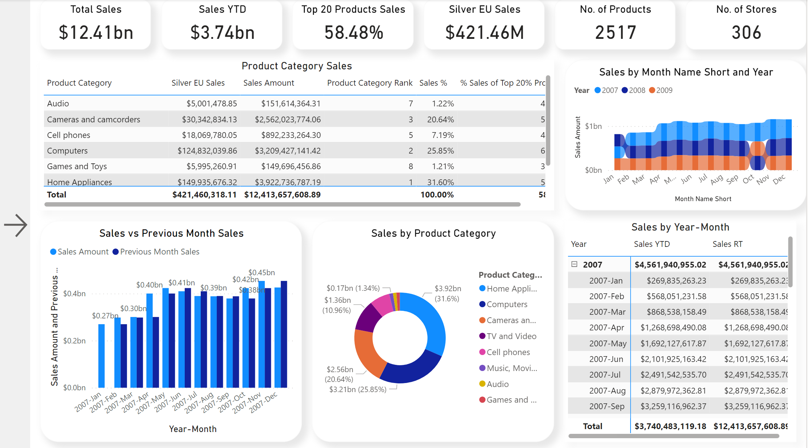
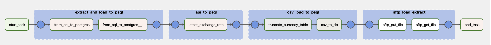
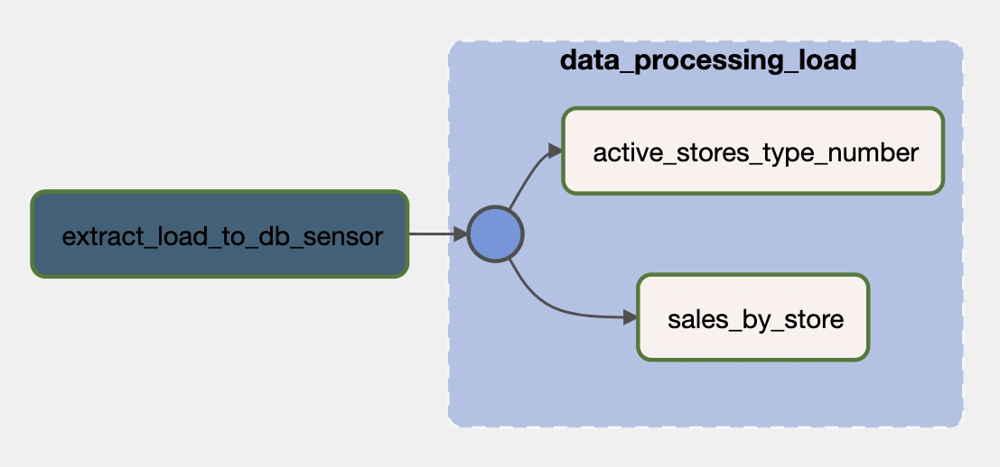

# Data Engineering - ETL, Apache Airflow and Spark, FastAPI, SQL, Data Warehouse, dbt, Data Analysis and Data Visualization, Docker and Kubernetes, Web scraping

### Built with

- Apache

  - Airflow
  - Spark

- API

  - FastAPI
    - sqlalchemy
    - pydantic
    - alembic
    - pytest

- Python

  - Pandas
  - matplotlib
  - seaborn
  - psycopg2
  - requests
  - sqlalchemy
  - dotenv
  - beautifulsoup
  - scrapy
  - Tools:
    - VSCode
    - Jupyter Notebook

- SQL

  - SQL Server
  - PostgreSQL
  - Tools:
    - Azure Data Studio
    - Dbeaver

- Data Warehouse

  - PostgreSQL
  - Star Schema

- dbt
  - models
  - macros
  - tests
  - seeds
  - dbt_packages
  - dbt documentation

- Cloud

  - Azure
    - Azure Functions
    - Blob Storage
    - Kubernetes Services
    - Azure Active Directory
    - SQL Databases
    - Data Factories
    - Synapse Analitics
  - AWS
    - Lambda
    - API Gateway
    - S3
    - RDS
    - IAM

- Power BI
  - DAX
  - M
- CI/CD
  - GitHub Actions
- Docker
  - Apache Airflow
- Kubernetes
  - Apache Airflow

## [SQL](/DB)

Here we have used Docker to run SQL Server on Mac and ContosoRetailDW as database. We have created [ER Diagram](/DB/ER%20Diagram/) with draw.io, and written [SQL Query](/DB/SQL%20Query/) with CTE, JOINS, Triggers, Procedures, Variables etc., and have [analyzed data with Python](/DB/Analytics/Python/):

- [SQL Query](/DB/SQL%20Query/)
- [ER Diagram](/DB/ER%20Diagram/)
- [Docker - SQL Server on Mac](/DB/Docker/)
- [data analysis and data visualization](/DB/Analytics/Python/) with Python.

## [Data Warehouse](/Data%20Warehouse/)

In this example we have created Data Warehouse with PostgreSQL where we have used star schema with "sales" fact table and "calendar", "store", "product" and "channel" as dimension tables. Fact table contains measure columns which are numeric and monetary values and FK to dimension tables. On the other side dimension tables contain descriptive information and they describe "who, what, where, when, how, and why". Dimension table usually contain big number of columns but much less rows than fact tables which is the case with our example as well.

- [SQL Query](/Data%20Warehouse/SQL%20Query/)

### Data Warehouse - Star Schema

  

## [Data Visualization with Power BI](/PowerBI)

In this example we have used data from ContosoRetailDW database were we have created multiple [DAX queries](/PowerBI/DAX.txt) and [Dashboard](PowerBI/Dashboard.png). To get data we have connected directly to SQL Server.

## [dbt](/dbt)

dbt is an open-source tool for transforming and modeling data within data warehouses using SQL. It simplifies the process by allowing users to define transformations, manage dependencies, test code, and generate documentation, all while leveraging SQL's power for data manipulation. In our example we used it with PostgreSQL database.

## [Python](/Python)

### [Data Analysis](/DB/Analytics/Python/)

In this example we have showed how to connect to SQL Server with [Python, analyze and visualize data](DB/Analytics/Python/). Here is the list of libraires we have used:

- pandas
- numpy
- seaborn
- matplotlib
- sqlalchemy
- dotenv

### [Big Data](/Python/big_data/)

In this example we have read big data from CSV file (9GB) and SQL Server database. Then we used Pandas group by to calculate the total amount.

### [Generator](/Python/Generator)

In this example we have created generator function to GET data from API. This way we yield the JSON response one chunk at a time.

### [Web Scraping](/Python/web_scraping)

In this example we have used beautifulsoup and scrapy to webscrape the data from a webshop.

## [Apache Airflow](/Apache/Airflow)

In this example we have created data pipeline with Apache Airflow. We have used different Airflow operators and sensors to extract, transform and load data. We have extract data from SQL Server, API, SFTP Server and store it in Postgres DB. Here is the list of Hooks, Operators and Sensors we have used:

- PythonOperator
- BashOperator
- SFTPOperator
- PostgresOperator
- DummyOperator
- ExternalTaskSensor
- BaseHook
- MsSqlHook

### ETL

 
 
 ### External Task Sensor and Processing
 
 
 ## [Apache Spark](/Apache/Spark)
 In this [example](/Apache/Spark/spark-example.ipynb) we have used Apache Spark to fetch data from Blob Storage. We have processed it and returned it back to Blob Storage as multiple parquet file organized in year and month directories. Also, we have showed how to: clean data, remove and create new columns, join, group by and analyze data.
 
 ## [API - FastAPI](/API/FastAPI) and [Azure Function - FastAPI](/API/Azure-FastAPI)
 In this example we have used python and FastAPI Web Framework and have created multiple GET, POST, PUT and DELETE APIs. To achive this we have used libraries like:
 + sqlalchemy
 + pydantic
 + alembic
 + pytest
 
 We have used Azure Function and published API with [Azure](/API/Azure-FastAPI)
 
  
  
 ## [CI/CD - GitHub Actions](/.github/workflows)
 Here we are using GitHub Actions to test our FastAPI code everytime after we push or pull new code to or from GitHub.

## [Docker](/Docker/)

Docker is a containerization platform that simplifies the packaging and deployment of applications with all their dependencies, ensuring consistency and portability across different environments. Here are the examples we built with Docker:

- [Apache Airflow](/Docker/Airflow/)

## [Kubernetes](/Kubernetes/)

Kubernetes is an open-source container orchestration system for automating software deployment, scaling, and management. Here are the examples we built with Kubernetes:

- [Apache Airflow on Kubernetes Kind](/Kubernetes/local/)
